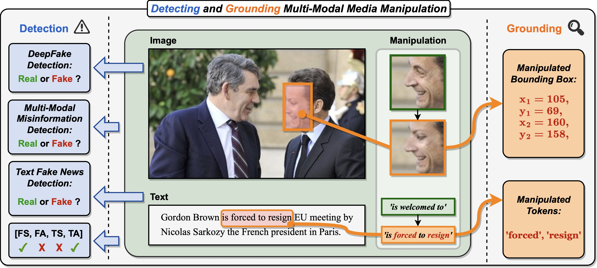
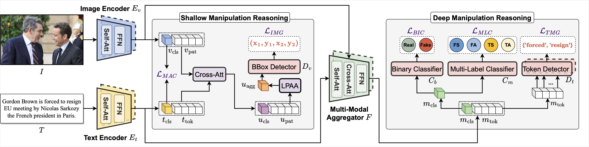
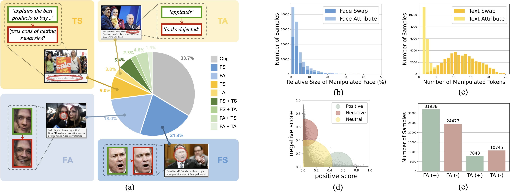
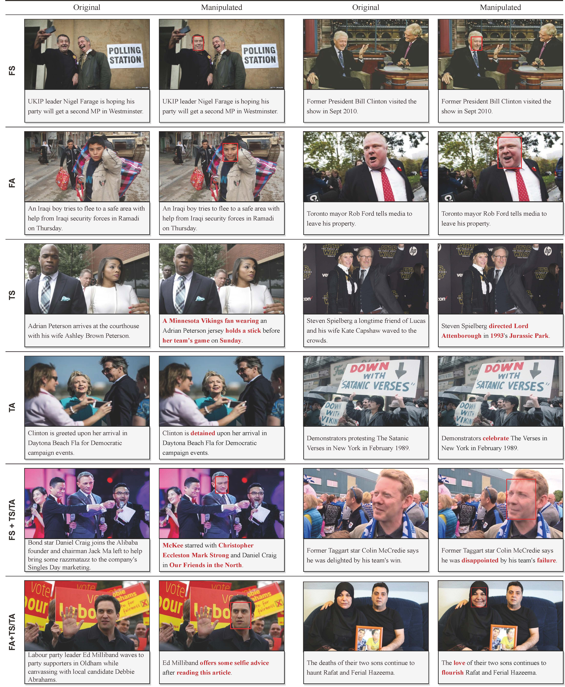
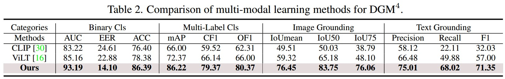
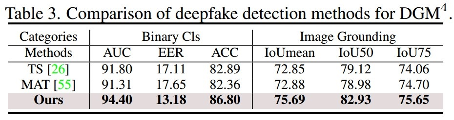
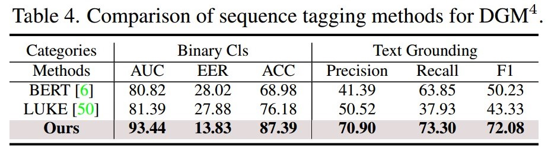
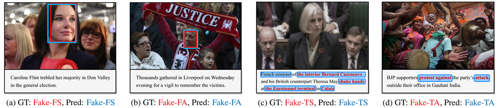
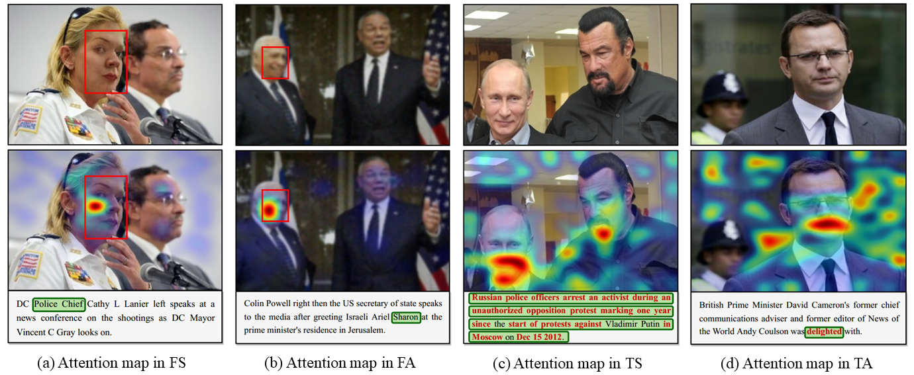

<!-- # MultiModal-DeepFake
[CVPR 2023] PyTorch code for DGM4: Detecting and Grounding Multi-Modal Media Manipulation -->

<div align="center">

<h1>DGM<sup>4</sup>: Detecting and Grounding Multi-Modal Media Manipulation</h1>

<div>
    <a href="https://rshaojimmy.github.io/" target="_blank">Rui Shao<sup>1,2</sup></a>
    <a href="https://tianxingwu.github.io/" target="_blank">Tianxing Wu<sup>2</sup></a>
    <a href="https://liuziwei7.github.io/" target="_blank">Ziwei Liu<sup>2</sup></a>
</div>
<div>
    <sup>1</sup>School of Computer Science and Technology, Harbin Institute of Technology (Shenzhen)
    <br>
    <sup>2</sup>S-Lab, Nanyang Technological University
</div>

<h4 align="center">
  <a href="https://rshaojimmy.github.io/Projects/MultiModal-DeepFake" target='_blank'>[Project Page]</a> |
  <a href="https://youtu.be/EortO0cqnGE" target='_blank'>[Video]</a> |
  <a href="https://arxiv.org/abs/2304.02556" target='_blank'>[Paper]</a> |
  <a href="https://lifehkbueduhk-my.sharepoint.com/:f:/g/personal/16483782_life_hkbu_edu_hk/En7oPhLwfNZLr4tY1H9xP94BEukx41MAJh7TCFkPcTRL5Q?e=8e1gKf" target='_blank'>[Dataset]</a>
</h4>
<br>



</div>

<h2>If you find this work useful for your research, please kindly star our repo and cite our paper.</h2>

## Updates
- [04/2023] Trained checkpoint is updated.
- [04/2023] Arxiv paper released.
- [04/2023] Project page and video are released.
- [04/2023] Code and dataset are released.

## Introduction
This is the official implementation of *Detecting and Grounding Multi-Modal Media Manipulation*. We highlight a new research problem for multi-modal fake media, namely **D**etecting and **G**rounding **M**ulti-**M**odal **M**edia **M**anipulation (**DGM<sup>4</sup>**). Different from existing single-modal forgery detection tasks, DGM<sup>4</sup> aims to not only detect the authenticity of multi-modal media, but also ground the manipulated content (*i.e.*, image bounding boxes and text tokens), which provide more comprehensive interpretation and deeper understanding about manipulation detection besides the binary classifcation. To faciliatate the study of DGM<sup>4</sup>, we construct the first large-scale DGM<sup>4</sup> **dataset**, and propose a novel **H**ier**A**rchical **M**ulti-modal **M**anipulation r**E**asoning t**R**ansformer (**HAMMER**) to tackle the task.

The framework of the proposed HAMMER model:

<div align="center">

</div>


## Installation

### Download
```
mkdir code
cd code
git clone https://github.com/rshaojimmy/MultiModal-DeepFake.git
cd MultiModal-DeepFake
```


### Environment
We recommend using Anaconda to manage the python environment:
```
conda create -n DGM4 python=3.8
conda activate DGM4
conda install --yes -c pytorch pytorch=1.10.0 torchvision==0.11.1 cudatoolkit=11.3
pip install -r requirements.txt
conda install -c conda-forge ruamel_yaml
```


## Dataset Preparation

### A brief introduction
We present <b>DGM<sup>4</sup></b>, a large-scale dataset for studying machine-generated multi-modal media manipulation. 
The dataset specifically focus on *human-centric news*, in consideration of its great public influence.
We develop our dataset based on the
[VisualNews](https://github.com/FuxiaoLiu/VisualNews-Repository) dataset, and form a total of <b>230k</b> news samples, including 77,426 pristine image-text pairs and 152,574 manipulated pairs. 
The manipulated pairs contain:
- 66,722 Face Swap Manipulations <b>(FS)</b> (based on [SimSwap](https://github.com/neuralchen/SimSwap) and [InfoSwap](https://github.com/GGGHSL/InfoSwap-master))
- 56,411 Face Attribute Manipulations <b>(FA)</b> (based on [HFGI](https://github.com/Tengfei-Wang/HFGI) and [StyleCLIP](https://github.com/orpatashnik/StyleCLIP))
- 43,546 Text Swap Manipulations <b>(TS)</b> (using [flair](https://github.com/flairNLP/flair) and [Sentence-BERT](https://github.com/UKPLab/sentence-transformers))
- 18,588 Text Attribute Manipulations <b>(TA)</b> (based on [B-GST](https://github.com/agaralabs/transformer-drg-style-transfer))

Where 1/3 of the manipulated images and 1/2 of the manipulated text are combined together to form 32,693 mixed-manipulation pairs.

Here are the statistics and some sample image-text pairs:

**Dataset Statistics:**
<div align="center">

</div>

**Dataset Samples:**
<div align="center">

</div>

### Annotations

Each iamge-text sample in the dataset is provided with rich annotations. For example, the annotation of a fake media sample with mixed-manipulation type (FA + TA) may look like this in the json file:

```
{
        "id": 768092,
        "image": "DGM4/manipulation/HFGI/768092-HFGI.jpg",
        "text": "British citizens David and Marco BulmerRizzi in Australia celebrate the day before an event in which David won",
        "fake_cls": "face_attribute&text_attribute",
        "fake_image_box": [
            155,
            61,
            267,
            207
        ],
        "fake_text_pos": [
            8,
            13,
            17
        ],
        "mtcnn_boxes": [
            [
                155,
                61,
                267,
                207
            ],
            [
                52,
                96,
                161,
                223
            ]
        ]
    }
```

Where `id` is the original news-id in the VisualNews Repository, `image` is the relative path of the manipulated image, `text` is the manipulated text caption, `fake_cls` indicates the manipulation type, `fake_image_box` is the manipulated bbox, `fake_text_pos` is the index of the manipulated tokens in the `text` string (in this case, corresponding to "celebrate", "event" and "won"), and `mtcnn_boxes` are the bboxes returned by MTCNN face detector. Note that the `mtcnn_boxes` is not used in both training and inference, we just kept this annotation for possible future usage.


### Prepare data
Download the DGM<sup>4</sup> dataset through this link: [DGM4](https://lifehkbueduhk-my.sharepoint.com/:f:/g/personal/16483782_life_hkbu_edu_hk/En7oPhLwfNZLr4tY1H9xP94BEukx41MAJh7TCFkPcTRL5Q?e=8e1gKf)

Then download the pre-trained model through this link: [ALBEF_4M.pth](https://storage.googleapis.com/sfr-pcl-data-research/ALBEF/ALBEF_4M.pth) (refer to [ALBEF](https://github.com/salesforce/ALBEF))

Put the dataset into a `./datasets` folder at the same root of `./code`, and put the `ALBEF_4M.pth` checkpoint into `./code/MultiModel-Deepfake/`. After unzip all sub files, the structure of the code and the dataset should be as follows:

```
./
├── code
│   └── MultiModal-Deepfake (this github repo)
│       ├── configs
│       │   └──...
│       ├── dataset
│       │   └──...
│       ├── models
│       │   └──...
│       ...
│       └── ALBEF_4M.pth
└── datasets
    └── DGM4
        ├── manipulation
        │   ├── infoswap
        │   |   ├── ...
        |   |   └── xxxxxx.jpg
        │   ├── simswap
        │   |   ├── ...
        |   |   └── xxxxxx.jpg
        │   ├── StyleCLIP
        │   |   ├── ...
        |   |   └── xxxxxx.jpg
        │   └── HFGI
        │       ├── ...
        |       └── xxxxxx.jpg
        ├── origin
        │   ├── gardian
        │   |   ├── ...
        |   |   ...
        |   |   └── xxxx
        │   |       ├── ...
        │   |       ...
        │   |       └── xxxxxx.jpg
        │   ├── usa_today
        │   |   ├── ...
        |   |   ...
        |   |   └── xxxx
        │   |       ├── ...
        │   |       ...
        │   |       └── xxxxxx.jpg
        │   ├── washington_post
        │   |   ├── ...
        |   |   ...
        |   |   └── xxxx
        │   |       ├── ...
        │   |       ...
        │   |       └── xxxxxx.jpg
        │   └── bbc
        │       ├── ...
        |       ...
        |       └── xxxx
        │           ├── ...
        │           ...
        │           └── xxxxxx.jpg
        └── metadata
            ├── train.json
            ├── test.json
            └── val.json

```


## Training

Modify `train.sh` and run:
```
sh train.sh
```

You can change the network and optimization configurations by modifying the configuration file `./configs/train.yaml`.


## Testing
Modify `test.sh` and run:
```
sh test.sh
```

## Benchmark Results
Here we list the performance comparison of SOTA multi-modal and single-modal methods and our method. Please refer to our paper for more details.

<div align="center">



</div>

### Model checkpoint

Checkpoint of our trained model (Ours) in Table 2: [best-model-checkpoint](https://lifehkbueduhk-my.sharepoint.com/:u:/g/personal/16483782_life_hkbu_edu_hk/EfFYi4B5UXZPpYQwnaxIxDUBFd41GbHngcbW3y1Z9nfWrg?e=LfKjVK)  

## Visualization Results

**Visualization of detection and grounding results.**
<div align="center">

</div>

**Visualization of attention map.**
<div align="center">

</div>

## Citation
If you find this work useful for your research, please kindly cite our paper:
```
@inproceedings{shao2023dgm4,
    title={Detecting and Grounding Multi-Modal Media Manipulation},
    author={Shao, Rui and Wu, Tianxing and Liu, Ziwei},
    booktitle={IEEE Conference on Computer Vision and Pattern Recognition (CVPR)},
    year={2023}
}
```

## Acknowledgements

The codebase is maintained by [Rui Shao](https://rshaojimmy.github.io/) and [Tianxing Wu](https://tianxingwu.github.io/).

This project is built on the open source repository [ALBEF](https://github.com/salesforce/ALBEF). Thanks the team for their impressive work!

